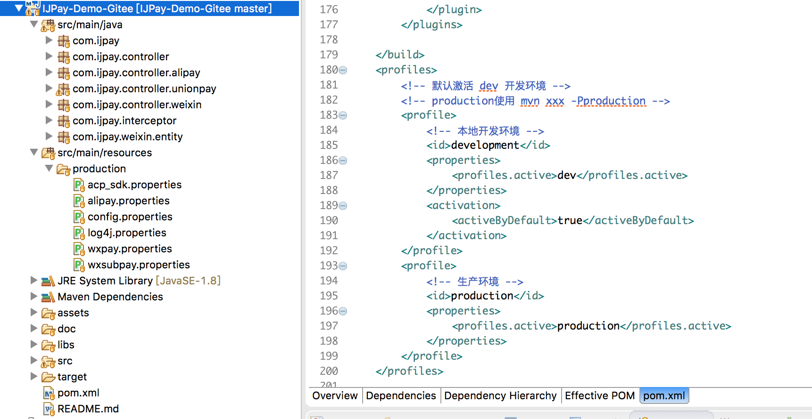

## IJPay 入门

### 1、准备工作

* JDK环境  [JDK安装以及开发环境搭建](https://blog.csdn.net/zyw_java/article/details/69215766)

* Maven环境 [Maven环境搭建](https://www.cnblogs.com/zyw-205520/p/4767633.html)

* Eclipse或者IDEA  [IDE中显示 \*.properties 为中文](https://blog.csdn.net/zyw_java/article/details/77487645)

### 2、开源项目导入IDE

[开源项目导入IDE](https://blog.csdn.net/zyw_java/article/details/61415051) 此文章是以 [weixin\_guide](https://gitee.com/javen205/weixin_guide) 为示例的。在导入`IJPay-Demo`时只需要将`clone 地址` 修改为`https://gitee.com/javen205/IJPay-Demo.git` 或者 `https://github.com/javen205/IJPay-Demo.git`

### 3、不同版本Demo分支切换

`IJPay-Demo` 目前提供了两个版本的Demo，[JFinal 版本](https://gitee.com/javen205/IJPay-Demo/tree/master/) \(master分支\) 以及[Spring Boot 版本](https://gitee.com/javen205/IJPay-Demo/tree/SpringBoot/)\(SpringBoot分支\)。IDE如何切换分支请自行搜索或者直接下载指定分支下的项目。

### 4、支付参数配置

**IJPay-Demo 导入到Eclipse后的目录结构如下 **

**IJPay-Demo  默认使用的环境为本地开发环境。所以需要将**`production`** 复制一份并重命名为 **`dev`

* acp\_sdk.properties 为银联支付参数配置文件
* alipay.properties 为支付宝支付参数配置文件
* wxpay.properties 为微信普通商户模式下支付参数配置文件
* wxsubpay.properties 为微信服务商模式下支付参数配置文件
* log4j.properties 为日志配置文件
* config.properties 为公众号先关参数配置文件\(其中的数据库配置目前没有使用到，可以忽略\)

### 5、支付宝应用配置以及初始化

[支付宝参考资料以及资料下载](ijpay/alipay/README.md)

[支付宝应用环境配置](ijpay/alipay/alipay-config.md)

[IJPay 支付宝初始化以及多应用的支持](ijpay/alipay/alipay-init.md)

### 6、调用支付宝支付接口


这里已支付宝Wap支付为例来讲解如何调用支付宝支付接口

[最新支付宝WAP支付文档](https://docs.open.alipay.com/203/105285/)

[支付宝支付-常用支付API详解\(查询、退款、提现等\)](https://blog.csdn.net/zyw_java/article/details/71844328)

 IJPay中封装的接口如下

```java
/**
 * WAP支付
 * @param response
 * @param model
 * @param returnUrl
 * @param notifyUrl
 * @throws {AlipayApiException}
 * @throws IOException
 */
public static void wapPay(HttpServletResponse response,AlipayTradeWapPayModel model,String returnUrl,String notifyUrl) throws AlipayApiException, IOException {
    String form = wapPayStr(response, model, returnUrl, notifyUrl);
    HttpServletResponse httpResponse = response;
    httpResponse.setContentType("text/html;charset=" + AliPayApiConfigKit.getAliPayApiConfig().getCharset());
    httpResponse.getWriter().write(form);// 直接将完整的表单html输出到页面
    httpResponse.getWriter().flush();
}
/**
 * WAP支付
 * @param response
 * @param model
 * @param returnUrl
 * @param notifyUrl
 * @return {String}
 * @throws {AlipayApiException}
 * @throws IOException
 */
public static String wapPayStr(HttpServletResponse response,AlipayTradeWapPayModel model,String returnUrl,String notifyUrl) throws AlipayApiException, IOException {
    AlipayTradeWapPayRequest alipayRequest = new AlipayTradeWapPayRequest();// 创建API对应的request
    alipayRequest.setReturnUrl(returnUrl);
    alipayRequest.setNotifyUrl(notifyUrl);// 在公共参数中设置回跳和通知地址
    alipayRequest.setBizModel(model);// 填充业务参数
    return AliPayApiConfigKit.getAliPayApiConfig().getAlipayClient().pageExecute(alipayRequest).getBody(); // 调用SDK生成表单
}
```

**记得在第5步中的支付宝支付参数初始化吗？**其中就有将`AliPayApiConfig`对象缓存到`AliPayApiConfigKit`的Map中。这里Wap支付就需要通过初始化参数来获取支付宝SDK支付客户端实例来进行wap支付`AliPayApiConfigKit.getAliPayApiConfig().getAlipayClient().pageExecute(alipayRequest).getBody()`

**业务逻辑实现**

```java
/**
 * Wap支付
 */
public void wapPay() {
    String body = "我是测试数据-By Javen";
    String subject = "Javen Wap支付测试";
    String totalAmount = getPara("totalAmount");
    String passbackParams = "1";
    String returnUrl = notify_domain + "/alipay/return_url";
    String notifyUrl = notify_domain + "/alipay/notify_url";

    AlipayTradeWapPayModel model = new AlipayTradeWapPayModel();
    model.setBody(body);
    model.setSubject(subject);
    model.setTotalAmount(totalAmount);
    model.setPassbackParams(passbackParams);
    String outTradeNo = StringUtils.getOutTradeNo();
    System.out.println("wap outTradeNo>"+outTradeNo);
    model.setOutTradeNo(outTradeNo);
    model.setProductCode("QUICK_WAP_PAY");

    try {
        AliPayApi.wapPay(getResponse(), model, returnUrl, notifyUrl);
    } catch (Exception e) {
        e.printStackTrace();
    }
    renderNull();
}
```

**IJPay-Demo中Wap支付默认访问路径为 **`http://域名/IP[:端口/项目名称]/alipay/wapPay`

到此IJPay支付宝支付使用流程已介绍完。支付宝的其他支付方式实现只是调用的接口不同，我相信聪明的你一定能get到。

### 7、微信支付

**IJPay 使用微信支付流程与支付宝支付一样。**

###### 1、配置支付参数\(属性文件或者数据库读取\)

###### 2、IJPay微信支付初始化\(主要设置通用参数，后面请求接口时不用每次重复设置\)

```java
WxPayApiConfig apiConfig = WxPayApiConfig.New()
                .setAppId(appid)
                .setMchId(mch_id)
                .setPaternerKey(partnerKey)
                .setPayModel(PayModel.BUSINESSMODEL);//PayModel.BUSINESSMODEL:普通商户模式  PayModel.SERVICEMODE:服务商模式
WxPayApiConfigKit.setThreadLocalWxPayApiConfig(apiConfig);
```

更多参数设置请参考 [WxPayApiConfig.java](https://gitee.com/javen205/IJPay/blob/master/src/main/java/com/jpay/weixin/api/WxPayApiConfig.java)

当然支付接口中也不用每次都设置`WxPayApiConfig`，可以通过`WxPayApiConfigKit.getApiConfig(String appId)`获取`WxPayApiConfig`

```java
WxPayApiConfigKit wxPayApiConfig =WxPayApiConfigKit.getApiConfig(appId);
```

源码请参考 [WxPayApiConfigKit](https://gitee.com/javen205/IJPay/blob/master/src/main/java/com/jpay/weixin/api/WxPayApiConfigKit.java)  多应用支持与支付宝类似请参考 [IJPay 支付宝初始化中的多应用支持](/alipay/alipay-init.md)


###### 3、调用支付接口

以公众号支付为例

```java
/**
 * 公众号支付
 */
public void webPay() {

    // openId，采用 网页授权获取 access_token API：SnsAccessTokenApi获取
    String openId = (String) getSession().getAttribute("openId");

    String total_fee=getPara("total_fee");

    if (StrKit.isBlank(openId)) {
        ajax.addError("openId is null");
        renderJson(ajax);
        return;
    }
    if (StrKit.isBlank(total_fee)) {
        ajax.addError("请输入数字金额");
        renderJson(ajax);
        return;
    }

    String ip = IpKit.getRealIp(getRequest());
    if (StrKit.isBlank(ip)) {
        ip = "127.0.0.1";
    }
    //处理统一下单请求参数
    Map<String, String> params = WxPayApiConfigKit.getWxPayApiConfig()
            .setAttach("IJPay 公众号支付测试  -By Javen")
            .setBody("IJPay 公众号支付测试  -By Javen")
            .setOpenId(openId)
            .setSpbillCreateIp(ip)
            .setTotalFee(total_fee)
            .setTradeType(TradeType.JSAPI)
            .setNotifyUrl(notify_url)
            .setOutTradeNo(String.valueOf(System.currentTimeMillis()))
            .build();
    //发起统一下单
    String xmlResult = WxPayApi.pushOrder(false,params);
log.info(xmlResult);
    //将统一下单后返回的xml转成Map
    Map<String, String> result = PaymentKit.xmlToMap(xmlResult);
    //判断支付状态
    String return_code = result.get("return_code");
    String return_msg = result.get("return_msg");
    if (!PaymentKit.codeIsOK(return_code)) {
        ajax.addError(return_msg);
        renderJson(ajax);
        return;
    }
    String result_code = result.get("result_code");
    if (!PaymentKit.codeIsOK(result_code)) {
        ajax.addError(return_msg);
        renderJson(ajax);
        return;
    }
    // 以下字段在return_code 和result_code都为SUCCESS的时候有返回
    String prepay_id = result.get("prepay_id");
    //进行二次签名封装唤起支付参数
    Map<String, String> packageParams = PaymentKit.prepayIdCreateSign(prepay_id);

    String jsonStr = JsonKit.toJson(packageParams);
    ajax.success(jsonStr);
    renderJson(ajax);
}
```

前端唤起微信支付流程请参考[公众号支付](ijpay/wxpay/wechatPay.md)

[微信公用API](ijpay/wxpay/api.md)

[微信支付API接口](ijpay/wxpay/allapi.md)


